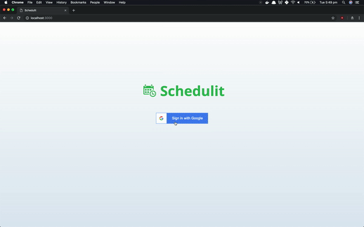

#  Schedulit

Schedulit is a single page Javascript web application built with React/Express/Mongo. Schedulit employs a simple and intuitive UI which allows the user to create and manage events all from one place. 
### Features: 
- Uses Google OAuth2 for login/signup
- Convenient dashboard for viewing all events
- Events are created with a shareable link
- Calendar component makes it easy to select multiple dates with differing hours
- Draggable time selection
- Clear visualization of shared availabilities
- Real-time updates
### Demo:

